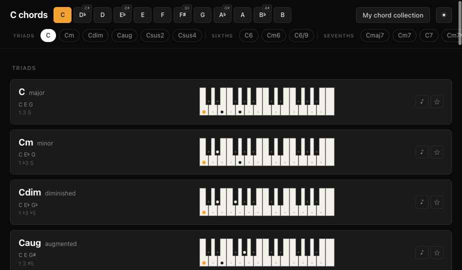
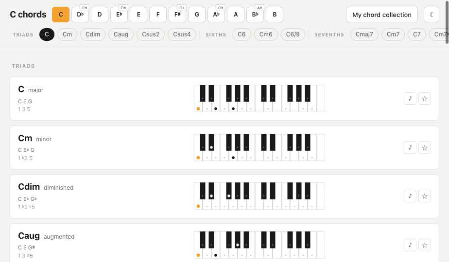
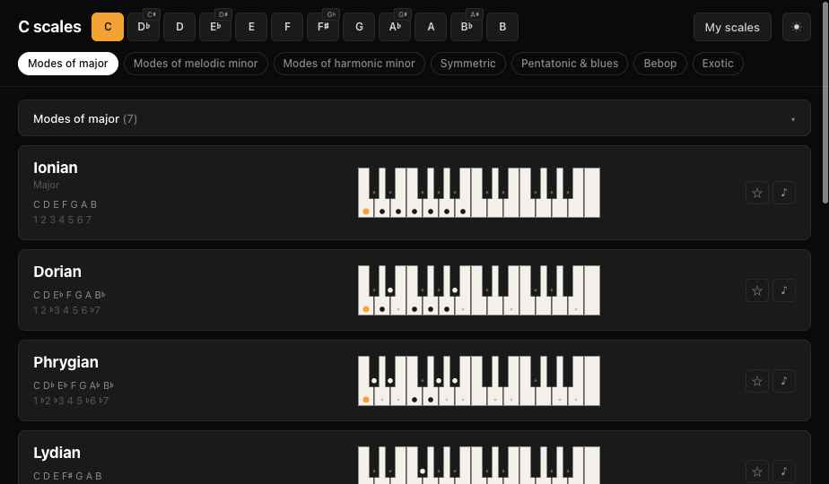
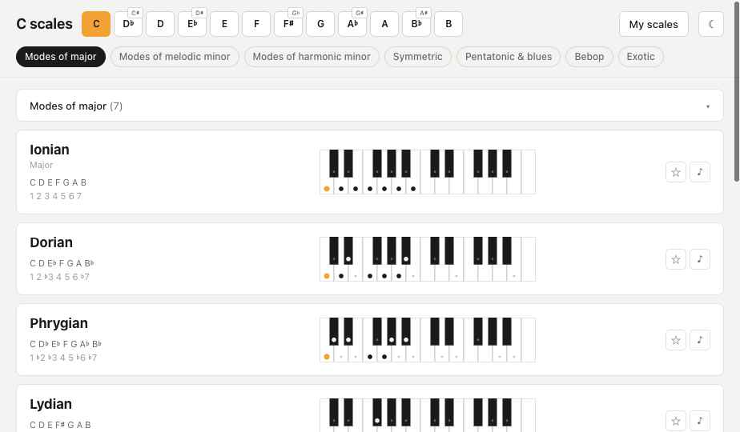
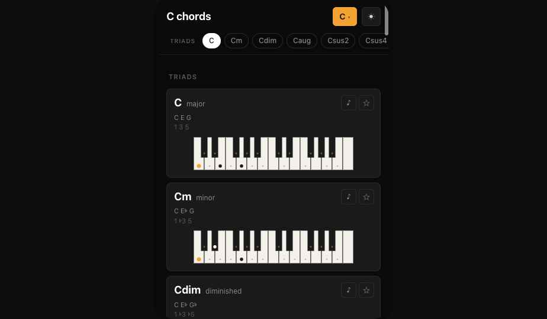
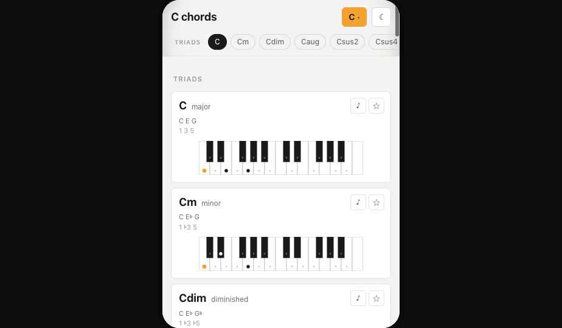
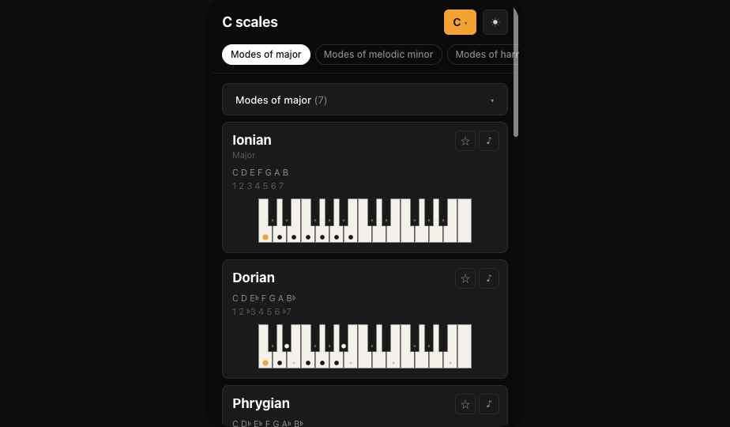
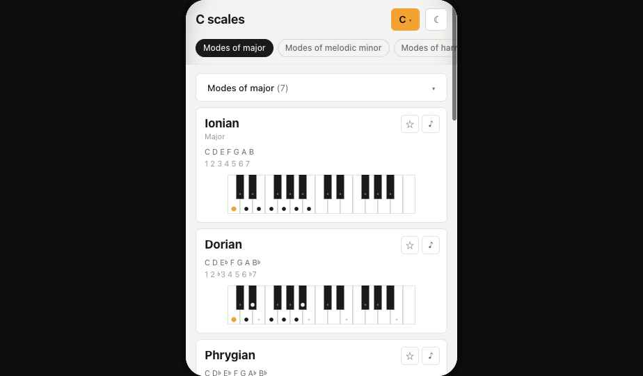
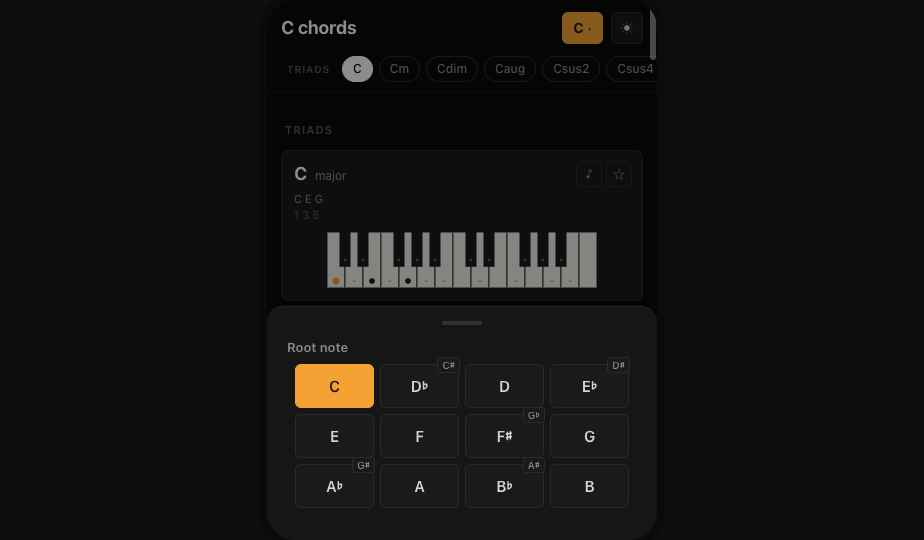

# Handoff: Sticky header — scales.jazzlore.com & chords.jazzlore.com

## Overview

A sticky header pattern for both Jazzlore web apps (chords and scales). Both apps share the same header shell so users move between them with no design surprise. The header packs three things on top of the page at all times:

1. Page title — e.g. **C chords** or **C scales** (reflects the active root note).
2. **Root-note picker** — 12 keys (C, D♭, D, E♭, E, F, F♯, G, A♭, A, B♭, B).
3. **Scroll-spy quick-access chip row** — a horizontal row of chips, one per chord (chords app) or per scale group (scales app), that auto-highlights the chip matching what's currently in view and jumps the page to that section on click.

A faint section header is drawn in the body between chord-type groups (TRIADS, SIXTHS, SEVENTHS, NINTHS, EXTENDED, ALTERED). On scroll, the page title shrinks for more breathing room. The header background is translucent with a backdrop-blur so cards subtly read through it.

On mobile, the full 12-key root picker is replaced by a compact **C ▾** pill that opens a bottom sheet. The chip row stays.

## About the Design Files

The files in `design/` are **design references created in HTML** — prototypes showing the intended look and behavior. They are **not production code** to ship as-is. The task is to recreate them in the existing Jazzlore codebase using its established patterns (framework, component library, state management, etc.). If the existing apps have a shared component package, the header should live there so both apps consume the same implementation.

## Fidelity

**High-fidelity.** Final colors, type sizes, spacing, motion, and interaction behavior are all defined. Recreate pixel-perfectly using the codebase's existing libraries — match exact CSS token values, spacing, and behavior described below.

The HTML prototype includes a switcher at the top (Chords/Scales · Desktop/Mobile · Dark/Light) and four "ingredient" cards underneath the headline; these are just for review and comparison and are NOT part of the production design. The production design is the **single header pattern** shown in the headline prototype.

---

## Selected design — V2bc

V2bc was selected from a 5-direction exploration (see `design/Jazzlore explorations.html` for context). It combines:
- **V2** structure — inline root picker on the title row.
- **V2b** chip row — uppercase category labels with subtle dividers.
- **V2c** surface — translucent header with backdrop-blur.

---

## Header anatomy (desktop)

```
┌──────────────────────────────────────────────────────────────────────┐
│ Row 1:  C chords [C][D♭][D][E♭][E][F][F♯][G][A♭][A][B♭][B]  ⟶  ⓘ ☾ │
│ Row 2:  TRIADS  C  Cm  Cdim  Caug  Csus2  Csus4 │ SIXTHS  C6  Cm6 …│
└──────────────────────────────────────────────────────────────────────┘
↑ sticky, translucent + backdrop-blur, border-bottom 1px divider
```

| Region | Content |
|---|---|
| Row 1 left | `<h1>` page title — `{root} chords` / `{root} scales`, 18px / 700 / -0.01em. |
| Row 1 center | Inline root-note picker — 12 buttons, 36px wide × 32px tall, 4px gap, 12px font. Active button = orange fill, dark text. |
| Row 1 right | "My chord collection" / "My scales" pill (32px, 13px), then theme toggle icon button (32×32). |
| Row 2 | Scroll-spy chip row — uppercase 10px group labels in muted dim color, 1px vertical dividers (14px tall) between groups, then individual chord chips (26px tall pill, 12px text). |

### Scroll-reactive title

Once `scroller.scrollTop > 24px`, the `.jl` wrapper gets `data-scrolled="true"` and the title shrinks from 18px → 15px (0.18s ease). Header padding tightens slightly. The chip row spacing also reduces.

### Translucent surface

```css
.jl-header {
  background: color-mix(in srgb, var(--jl-bg) 78%, transparent);
  backdrop-filter: saturate(140%) blur(14px);
  -webkit-backdrop-filter: saturate(140%) blur(14px);
}
```

---

## Header anatomy (mobile)

```
┌─────────────────────────────────┐
│ Row 1:  C chords        C ▾  ☾  │
│ Row 2:  TRIADS  C  Cm  Cdim  …  │  ← horizontally scrollable
└─────────────────────────────────┘
```

| Region | Content |
|---|---|
| Row 1 left | Page title — 18px / 700. |
| Row 1 right | **Root compact button** — orange pill, "C ▾" pattern (current root + chevron). Tapping it opens the bottom sheet. Then theme toggle icon. |
| Row 2 | Same chip row as desktop, horizontally scrollable, no fixed width. |

### Root-note bottom sheet (mobile only)

Opened from the **C ▾** pill. Renders as a bottom sheet that fills the bottom of the viewport with a translucent backdrop covering everything above.

- Backdrop: full-frame `rgba(0,0,0,0.45)`, tap to dismiss.
- Sheet: bottom-anchored, border radius 16/16/0/0, 14px horizontal padding, 20px bottom padding (safe-area inset on real device).
- Header: a small grey "handle" indicator (40×4 pill, 0.4 opacity), then "Root note" label.
- Body: 12 root-note buttons in a **4-column grid**, 44px tall — same look as desktop's root picker.
- Selecting a root immediately updates the page and closes the sheet.

Enharmonic toggle preserved. Each ambiguous root button (D♭, E♭, F♯, A♭, B♭) carries the same superscript badge as the desktop picker showing its alternate spelling (C♯, D♯, G♭, G♯, A♯). Tapping the badge — not the main button — toggles the button's spelling for the rest of the session, matching the desktop behavior exactly. Tapping the main button selects that root and closes the sheet as described above. The two interactions are visually and behaviorally distinct: badge = change spelling, button = select root.

**IMPORTANT — implementation detail that bit us:** the bottom sheet must NOT be rendered inside the sticky header. `position: absolute` would then anchor to the sticky header's box (~100px tall) instead of the full screen, clipping the sheet. Render the sheet at the app-shell level (a sibling of the scroll container) or via a portal that lands at the page-root level.

---

## Scroll-spy chip row

The single most important interaction in the header.

### Behavior

1. As the user scrolls the page, the chip whose target section is currently at the top of the viewport (just below the sticky header) gets `aria-current="true"` and visually highlights (filled background = `--jl-text`, fill text = `--jl-bg`).
2. The active chip auto-scrolls into view inside the chip row if it would otherwise be off-screen — keep ~40px of buffer on either side and `scrollTo({ behavior: "smooth" })` to a centered position.
3. Clicking any chip scrolls the page to that section, smoothly. Account for the sticky header height (subtract ~220px on desktop, ~140px on mobile) so the target lands just below the header, not under it.

### Implementation sketch

```js
// 1. Resolve all chip target DOM elements.
const targets = chips.map(chip => ({
  id: chip.id,
  el: scroller.querySelector(`#${prefix}${chip.id}`)
})).filter(x => x.el);

// 2. On every scroll event (passive), find the last target whose
//    top is at-or-above the threshold (sticky-header height).
const onScroll = () => {
  const threshold = scroller.getBoundingClientRect().top + 240;
  let current = targets[0].id;
  for (const t of targets) {
    if (t.el.getBoundingClientRect().top <= threshold) current = t.id;
    else break;
  }
  setActive(current);
};

// 3. Click-to-jump.
const jumpTo = (id) => {
  const el = scroller.querySelector(`#${prefix}${id}`);
  const elTop = el.getBoundingClientRect().top;
  const scTop = scroller.getBoundingClientRect().top;
  scroller.scrollBy({ top: elTop - scTop - 220, behavior: "smooth" });
};
```

`IntersectionObserver` works too; the scroll-listener form above was used in the prototype for tight control.

### Chip categories — chords app

| Group label | Chord IDs (in order) |
|---|---|
| TRIADS | `maj`, `m`, `dim`, `aug`, `sus2`, `sus4` |
| SIXTHS | `6`, `m6`, `69` |
| SEVENTHS | `maj7`, `m7`, `7`, `m7b5`, `dim7`, `mMaj7` |
| NINTHS | `maj9`, `m9`, `9`, `7b9`, `7#9` |
| EXTENDED | `m11`, `maj7#11`, `7#11`, `maj13`, `13` |
| ALTERED | `7b13`, `alt` |

### Chip categories — scales app

The chip row contains **one chip per scale group**, not per individual scale. Each chip's target is the scale-group accordion row:
- Modes of major (7)
- Modes of melodic minor (7)
- Modes of harmonic minor (7)
- Symmetric (3)
- Pentatonic & blues (4)
- Bebop (4)
- Exotic (6)

The scales app already groups its scales under collapsible accordions. When a chip is clicked, the page scrolls to the target group header and that accordion auto-expands if it was collapsed. This is handled by the scales app's onChipActivate callback, not by the StickyHeader component itself — the header simply reports which chip was activated; expanding the accordion is the app's responsibility. If a user clicks the same chip while the accordion is already open, the accordion stays open (no toggle-off behavior). The chords app does not use onChipActivate because there are no accordions to expand.

---

## Body section headers (chords app)

Between each chord group in the body list, render a divider-style header:

```
┌───────────────────────────────────────────────┐
│  TRIADS  ─────────────────────────────────────│
└───────────────────────────────────────────────┘
```

- Text: 11px / 600 / 0.1em letter-spacing / uppercase, color `--jl-text-dim`.
- Padding: 18px top / 6px bottom, 4px horizontal.
- A `::after` pseudo-element draws a 1px divider line filling the remaining horizontal space using `--jl-divider`.
- `scroll-margin-top: 220px` so jump-to-section lands cleanly under the sticky header.

These section headers replace the previous flat list of chord cards. The scroll-spy still anchors against the individual chord cards (which have their own `id`s); section headers are visual landmarks only and don't need to be scroll-spy targets unless you'd prefer the user to think of the list as group-anchored.

---

## Design tokens

All tokens are defined as CSS custom properties on `.jl` (dark theme default) and overridden on `.jl[data-theme="light"]`. Copy these verbatim into the production stylesheet (or map them to the existing design-system tokens if your app already has a similar scale).

### Colors — dark theme

| Token | Hex | Use |
|---|---|---|
| `--jl-bg` | `#0a0a0a` | Page background |
| `--jl-bg-elev` | `#161616` | Elevated surfaces (bottom sheet) |
| `--jl-card` | `#1a1a1a` | Card background |
| `--jl-card-border` | `#2a2a2a` | Card border |
| `--jl-card-hover` | `#1f1f1f` | Card hover state |
| `--jl-text` | `#ffffff` | Primary text |
| `--jl-text-muted` | `#8a8a8a` | Secondary text |
| `--jl-text-dim` | `#5a5a5a` | Tertiary text, section headers |
| `--jl-divider` | `#232323` | 1px borders, dividers |
| `--jl-control-bg` | `#1a1a1a` | Root button, util pill background |
| `--jl-control-border` | `#2a2a2a` | Root button border |
| `--jl-control-text` | `#d4d4d4` | Control text |
| `--jl-control-hover` | `#232323` | Control hover background |
| `--jl-accent` | `#f4a233` | Active root pill, root-note dot on keyboards |
| `--jl-accent-fg` | `#1a1a1a` | Text on accent |
| `--jl-key-white` | `#f4f1ea` | Piano white keys |
| `--jl-key-black` | `#1a1a1a` | Piano black keys |
| `--jl-key-border` | `#2a2a2a` | Piano key outline |

### Colors — light theme (overrides)

| Token | Hex |
|---|---|
| `--jl-bg` | `#f3f3f1` |
| `--jl-bg-elev` | `#ffffff` |
| `--jl-card` | `#ffffff` |
| `--jl-card-border` | `#e5e3de` |
| `--jl-card-hover` | `#fafafa` |
| `--jl-text` | `#1a1a1a` |
| `--jl-text-muted` | `#6a6a6a` |
| `--jl-text-dim` | `#999` |
| `--jl-divider` | `#e5e3de` |
| `--jl-control-bg` | `#ffffff` |
| `--jl-control-border` | `#d8d6d0` |
| `--jl-control-text` | `#1a1a1a` |
| `--jl-control-hover` | `#f5f5f3` |
| `--jl-accent` | `#f4a233` (same orange) |
| `--jl-key-white` | `#ffffff` |
| `--jl-key-border` | `#c8c6c0` |

### Typography

- **Font stack:** `-apple-system, BlinkMacSystemFont, "Segoe UI", Helvetica, Arial, sans-serif`
- **Title (desktop V2):** 18px / 700 / -0.01em letter-spacing
- **Title (mobile):** 18px / 700
- **Title (scrolled):** 15px / 700 / 0.88 opacity
- **Root button:** 12px / 600 (desktop inline) · 15px / 600 (full-size in sheet)
- **Chip:** 12px / 500
- **Chip group label:** 10px / 600 / uppercase / 0.08em tracking
- **Section header (body):** 11px / 600 / uppercase / 0.1em tracking
- **Util pill:** 13px / 500
- **Enharmonic superscript on root button:** 10px / 500 (8px / 500 on inline-mode root buttons)

### Spacing & sizing

| | Desktop | Mobile |
|---|---|---|
| Header row vertical padding | 14px | 12px |
| Header row horizontal padding | 20px | 14px |
| Inter-row gap between rows | 12px | 8px |
| Body padding | 14px 20px 80px | 12px 14px 80px |
| Card gap | 10px | 8px |
| Card padding | 14px 16px | 12px |
| Chip row horizontal padding | 20px | 14px |
| Chip row gap | 6px | 6px |
| Chip height | 26px | 26px |
| Chip horizontal padding | 10px | 10px |
| Chip border-radius | 13px (pill) | 13px |
| Root button (full) | 44px × auto, 6px gap, 12 cols | 4 cols × 44px in sheet |
| Root button (inline) | 32px × 36px | n/a |
| Sticky header z-index | 50 | 50 |
| Bottom sheet z-index | 100 | 100 |

### Radii & motion

- Card / pill / control radius: **8px**, except chips (**13px**, pill).
- Bottom sheet radius: **16px** top corners only.
- Title shrink: `transition: font-size 0.18s ease, opacity 0.18s ease`.
- Header padding transition: `0.18s ease`.
- Chip row smooth-scrolls active chip into view: `scrollTo({ behavior: "smooth" })`.
- Click-to-jump: `scrollBy({ behavior: "smooth" })`.
- Hover transitions: 0.12s on all controls.

---

## Component breakdown (suggested implementation)

```
<StickyHeader …props>
   ├ <PageTitle>      from props.title  (e.g. "C chords" / "C scales")
   ├ <InlineRootPicker> (desktop)  |  <RootCompactButton> (mobile)
   ├ <UtilButtons>     from props.utilLink + theme toggle
   └ <QuickAccessChipRow> from props.chipGroups
        ├ category label (e.g. "TRIADS")
        ├ <Chip data-id="maj">C</Chip>
        ├ <Chip data-id="m">Cm</Chip>
        ├ …
        ├ <Divider>
        ├ category label "SIXTHS"
        └ …
<BottomSheet>  ← rendered at app-shell level, NOT inside the header
   ├ <SheetHandle>
   ├ <SheetTitle> Root note
   └ <FullRootPicker>  (4-column grid, 12 cells)
```

### Props for `StickyHeader`

The component is purely presentational and content-driven. It takes pre-computed data and has zero domain knowledge of chords vs. scales. Each consuming app composes its own title, util label, and chip groups.

| Prop | Type | Notes |
|---|---|---|
| `title` | `string` | Page title shown in row 1 left (e.g. `"C chords"`, `"C scales"`). Caller is responsible for formatting. |
| `root` | `RootNote` | Current root note. Drives which root-picker button is active. |
| `onRootChange` | `(RootNote) => void` | Fired by both the inline picker (desktop) and the bottom sheet (mobile). |
| `utilLink` | `{ label: string; href: string }` | The right-side pill. Caller passes `{ label: "My chord collection", href: "/collection/chords" }` or `{ label: "My scales", href: "/collection/scales" }`. |
| `chipGroups` | `ChipGroup[]` | The scroll-spy chip row data. See shape below. |
| `theme` | `"dark" \| "light"` | Applied via `data-theme` on the root. |
| `onThemeToggle` | `() => void` | |
| `scrollerRef` | `Ref<HTMLElement>` | The scrollable container the chip row scroll-spies against. |
| `onChipActivate` | `(chipId: string) => void` (optional) | Called when a chip is clicked, after the scroll-jump. The scales app uses this to auto-expand the target accordion. |

```ts
type ChipGroup = {
  label: string;        // e.g. "TRIADS", "Modes of major"
  chips: Chip[];
};

type Chip = {
  id: string;           // anchor target id (without the # prefix)
  label: string;        // displayed text, e.g. "C", "Cmaj7", "Modes of major"
};
```

The component knows nothing about chords or scales — it just renders the chip groups it's given and reports clicks back via `onChipActivate`. Each app constructs its own `chipGroups` array and decides how to react to chip activation.

### State held above

- `root` — managed by the app's URL/route, passed in via props
- `theme` — persisted to localStorage, passed in via props
- `scrollTop` of the page scroller — derived inside the header via `scrollerRef` for the `data-scrolled` flag
- `bottomSheetOpen` (mobile only) — managed at the app-shell level, since the sheet is rendered as a sibling of the scroll container (see "implementation detail that bit us")

---

## Responsive breakpoint

The mock uses a **device-attribute switch** (`data-device="desktop" | "mobile"`) rather than a CSS breakpoint. In production, switch via a real CSS media query — suggested breakpoint **640px**. Below that, render the mobile header; at or above, render the desktop header.

If the existing apps already have a responsive system, use it.

---

## Accessibility

- Root buttons are `<button>` with `aria-pressed="true|false"`.
- Chips are `<button>` with `aria-current="true|false"`.
- Chip row is keyboard-scrollable (it's a real overflowing `<div>` with focusable children) and chip click traps focus on the target via the smooth-scroll jump.
- Bottom sheet: backdrop is a `<div>` with click-to-close; sheet itself should trap focus and close on `Esc`. The prototype doesn't fully implement focus-trap — please add this for production.
- Decorative chevron `▾` on the C ▾ button is wrapped in a `<span>` that should be `aria-hidden="true"`.
- The piano-keyboard SVGs inside chord/scale cards are decorative — the notes are also given as text immediately above, so `role="img"` with a descriptive `aria-label` is sufficient (e.g. `"C major chord — C, E, G"`).

---

## Out of scope (kept as-is from current apps)

The redesign affects ONLY the header pattern and the body section dividers between chord groups. These are unchanged:

- Chord/scale **card layout** (left text block · piano keyboard · star/play buttons).
- Card content / data — every chord type, every scale group.
- Notation rendering (treble clef + notes).
- The card's mini-keyboard SVG style.
- The accordion behavior in the scales app (scale groups expand/collapse).
- The favorites/play buttons (`☆` / `♪`) on each card.
- Routing between the two apps.

The current mocks render simplified versions of these for context; the production cards should be left exactly as they already are.

---

## Reference screenshots

All eight base states (Chords × Scales × Desktop × Mobile × Dark × Light) plus the mobile bottom-sheet open state are captured in `screenshots/`. They're numbered for ordered viewing.

### Desktop

| Chords · Dark | Chords · Light |
|---|---|
|  |  |

| Scales · Dark | Scales · Light |
|---|---|
|  |  |

### Mobile

| Chords · Dark | Chords · Light |
|---|---|
|  |  |

| Scales · Dark | Scales · Light |
|---|---|
|  |  |

### Mobile — root-note bottom sheet open



The sheet anchors to the bottom of the frame, the backdrop dims everything above. Tap the backdrop or pick a root to dismiss.

---

## Files in this bundle

```
design_handoff_sticky_header/
├── README.md                          ← this file
├── screenshots/                       ← reference captures of the final design
│   ├── 01-chords-desktop-dark.png
│   ├── 02-chords-desktop-light.png
│   ├── 03-scales-desktop-dark.png
│   ├── 04-scales-desktop-light.png
│   ├── 05-chords-mobile-dark.png
│   ├── 06-chords-mobile-light.png
│   ├── 07-scales-mobile-dark.png
│   ├── 08-scales-mobile-light.png
│   └── 09-mobile-root-sheet.png       ← bottom sheet open state
└── design/
    ├── index.html                     ← headline V2bc prototype + ingredient comparison
    ├── Jazzlore explorations.html     ← original 5-direction exploration (context only)
    ├── jazzlore.css                   ← all design tokens + header / chip / sheet CSS
    ├── data.js                        ← chord catalog + scale-group list + roots
    ├── components.jsx                 ← shared React components (RootPicker, ChipRow, MiniKeyboard, RootSheet…)
    ├── variations.jsx                 ← five header variations (V2 / V2g is the selected one)
    └── jazz-app.jsx                   ← app shell that wires header + body + scroller + sheet
```

To run the prototype locally, just open `design/index.html` in a browser — it's a single static file with CDN-hosted React/Babel.

### Key files to reference

| File | What to look at |
|---|---|
| `jazzlore.css` | All design tokens. Sections: `Sticky header shell`, `Root note picker`, `Quick-access chip row`, `Mobile specifics`, `Bottom sheet`, `Scroll-reactive`, `Translucent`. |
| `variations.jsx` → `HeaderV2`, `HeaderV2Grouped` | The selected header. `HeaderV2Grouped` wraps `HeaderV2` with `groupedChips={true}` — that's the V2bc form. |
| `components.jsx` → `ChipRow` | Scroll-spy implementation. Reference for behavior, not for direct copy (uses prototype-only patterns like `CSS.escape` over data attributes). |
| `components.jsx` → `RootSheet` | Bottom-sheet markup. Note: rendered at app-shell level, not inside the header. |
| `jazz-app.jsx` → `JazzApp` | Shows the parent component lifting `rootSheetOpen` state above the header — the fix to the "sheet floats above the visible area" bug. |
| `data.js` → `JL_CHORD_GROUPS` | Category groupings used by the chip row's group labels + body section headers. |

---

## Questions to confirm with the design team

If implementation surfaces these:

1. Should the chip row also include **section headers** on mobile, or hide them and keep only the chips for density? Current mock keeps them on both.
2. Theme preference — is it stored per-user server-side, or just `localStorage`? The mock only changes locally.
3. The 27 chord chips fit on a 1280px viewport with room to spare; below ~1100px the row starts horizontal-scrolling. Confirm that's acceptable, or whether we should reduce density at narrower widths (e.g. drop to group anchors only).
4. The translucent header relies on `backdrop-filter`, which has full modern-browser support but degrades gracefully to a solid background. Confirm acceptable fallback.
